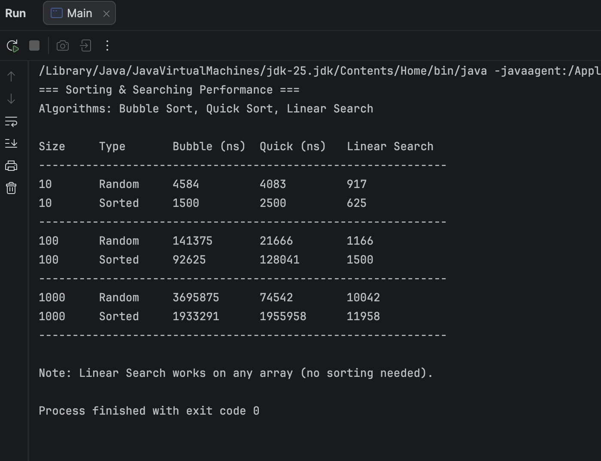
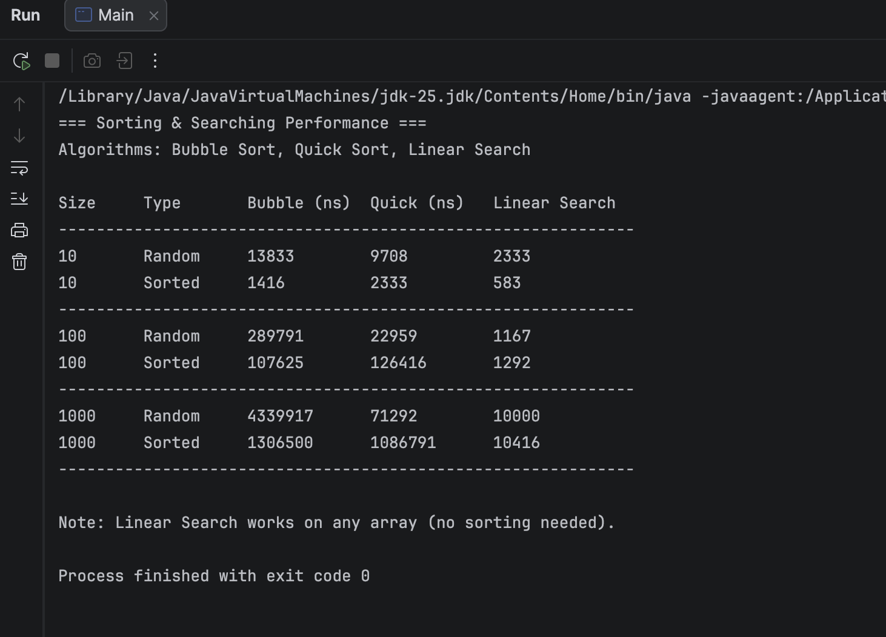
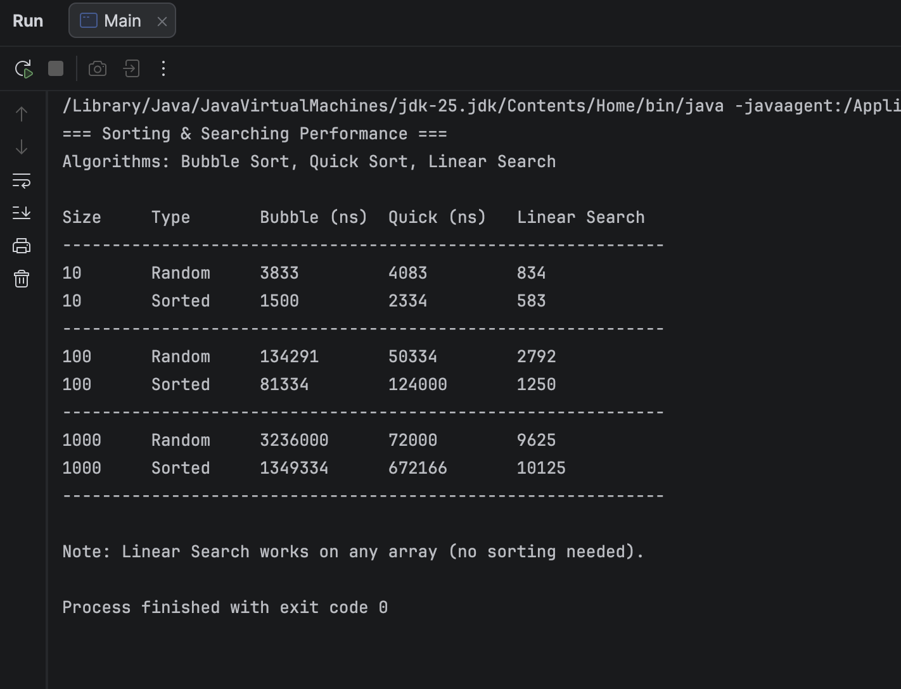

Name: Aruzhan Rsaliyeva

Group: IT-2502

A. Project overview

Selected Algorithms:

Basic sort: bubble sort

Advanced sort: quick sort

Search: Linear search

Puprose:

To implement and compare the performance of these algorithms on different input sizes (10, 100, 1000) and types (random, sorted). Execution time is measured using `System.nanoTime()` and analysed against theoretical Big-O complexity

B. Algorithm descriptions

Bubble sort:

How it works: Repeatedly steps through the list, compares adjacent elements, and swaps them if they are in the wrong order. The pass through the list is repeated until no swaps are needed.  

Time complexity: O(n²) worst/average case, O(n) best case (already sorted)

Quick sort:

How it works: selects a pivot element, partitions the array so that elements smaller than the pivot come before it and larger after, then recursively sorts the subarrays

Time complexity: O(n log n) average case, O(n²) worst case (rare with good pivot selection)

Linear Search:

How it works: Sequentially checks each element of the array until the target is found or the end is reached

Time complexity: O(n) – linear time

C. Experimental results

10 Random 4083 3875 792

10 Sorted 1583 2459 625

100 Random 144416 22250 1208

100 Sorted 91083 159541 1292

1000 Random 3255208 74125 9375

1000 Sorted 2393875 2461042 9292

Comparisons:

Different input sizes: Bubble Sort grows quadratically from 100 to 1000 elements, time jumps from 144k to 3.25M ns (22x increase). Quick Sort grows near linearly from 22k to 74k ns (3.3x increase). Linear Search grows linearly from 1.2k to 9.4k ns (7.8x increase)

Sorted vs unsorted: Bubble Sort runs faster on sorted data (1.4–2.6x) due to O(n) best case. Quick Sort runs much slower on sorted data at size 1000, sorted is 33x slower (2.46M vs 74k ns) because last‑element pivot causes O(n²) worst case. Linear Search is unaffected (times nearly identical).

D. Screenshots

